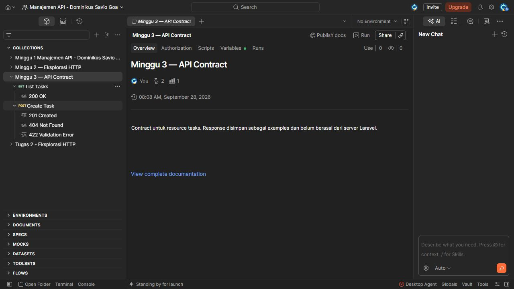
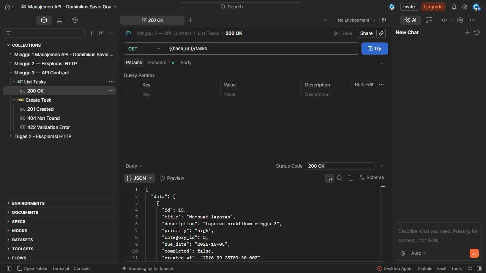
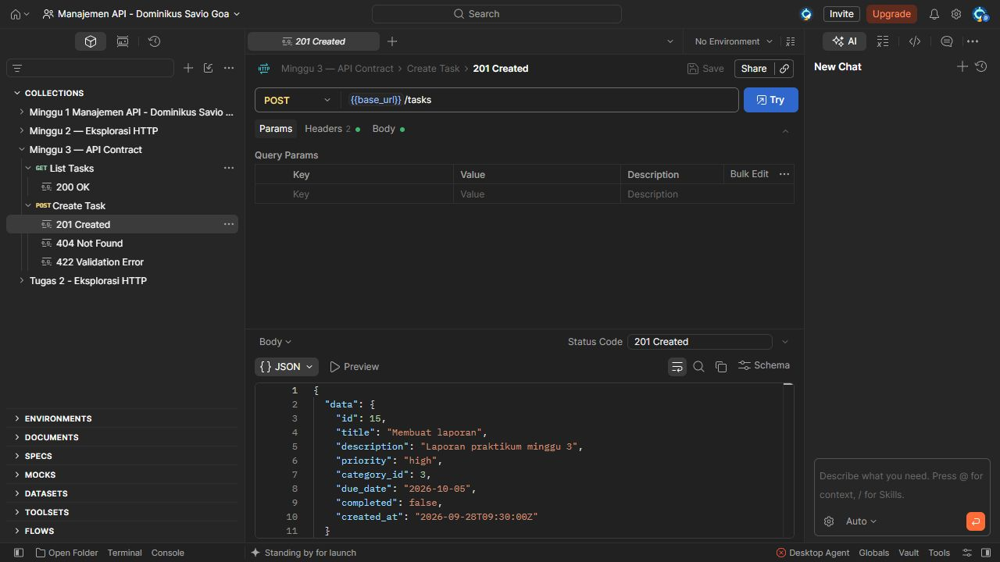
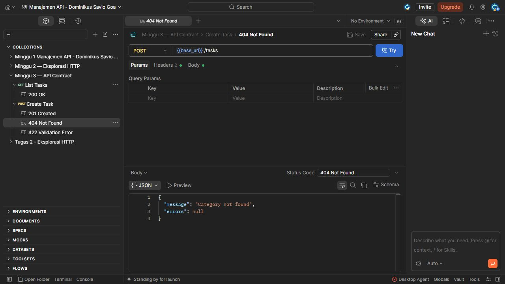
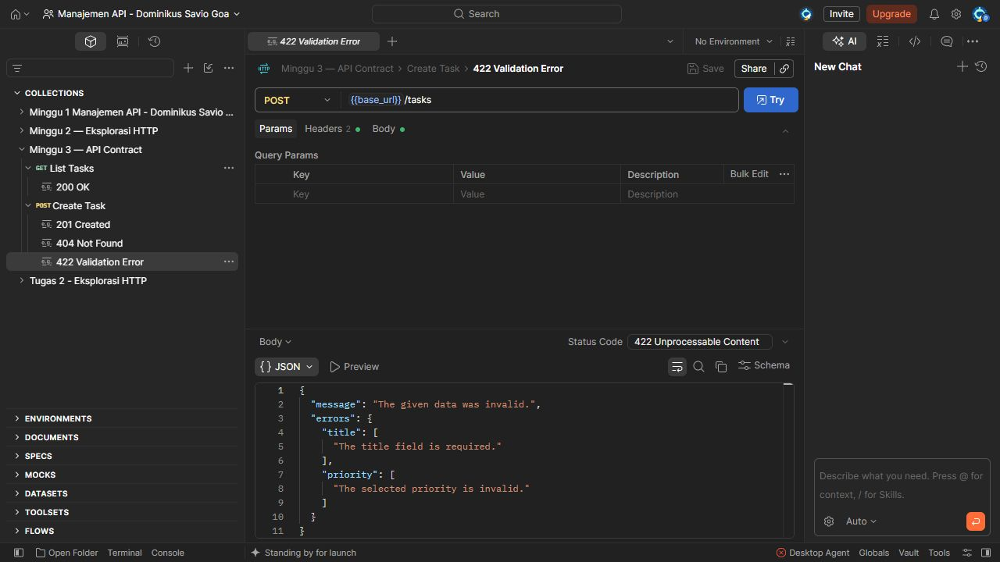

# Tugas 3 - Draft API Contract

## 1. Tujuan

Pada tugas ini saya mencoba membuat API contract untuk resource `Task`.
Contract ini saya buat sebelum implementasi Laravel agar bentuk request dan
response tidak berubah-ubah.

## 2. Perubahan

Perubahan yang saya kerjakan:

- membuat resource dictionary untuk `Task`;
- membuat daftar endpoint CRUD;
- membuat contoh JSON request dan response;
- menambahkan response example `200`, `201`, `404`, dan `422` di Postman;
- memperbarui collection `Minggu 3 — API Contract` di Postman.



## 3. Endpoint atau Contract

### Resource Task

| Field | Type | Saat create | Aturan |
| --- | --- | --- | --- |
| `id` | integer | Tidak dikirim | Dibuat server |
| `title` | string | Wajib | 3-150 karakter |
| `description` | string | Opsional | Maksimal 500 karakter |
| `priority` | string | Wajib | `low`, `medium`, atau `high` |
| `category_id` | integer | Wajib | Category harus tersedia |
| `due_date` | string | Opsional | Format `YYYY-MM-DD` |
| `completed` | boolean | Opsional | Default `false` |
| `created_at` | string | Tidak dikirim | Dibuat server, format ISO 8601 |

### Daftar Endpoint

| Method | Endpoint | Kegunaan | Success | Error |
| --- | --- | --- | --- | --- |
| `GET` | `/api/tasks` | Melihat daftar task | `200` | - |
| `POST` | `/api/tasks` | Membuat task | `201` | `404`, `422` |
| `GET` | `/api/tasks/{task}` | Melihat satu task | `200` | `404` |
| `PATCH` | `/api/tasks/{task}` | Mengubah sebagian task | `200` | `404`, `422` |
| `DELETE` | `/api/tasks/{task}` | Menghapus task | `204` | `404` |

### Contoh Request

```http
POST /api/tasks
Accept: application/json
Content-Type: application/json
```

```json
{
  "title": "Membuat laporan",
  "description": "Laporan praktikum minggu 3",
  "priority": "high",
  "category_id": 3,
  "due_date": "2026-10-05"
}
```

Saya tidak mengirim `id`, `completed`, dan `created_at`. Nilai tersebut memakai
default atau dibuat oleh server.

## 4. Bukti Pengujian

Pengujian contract dilakukan dengan membuka response example yang tersimpan di
Postman. Example ini dipakai untuk memeriksa method, URL, status code, dan bentuk
JSON. Backend Laravel belum dijalankan pada tahap ini.

### Success - 200 OK

`GET /api/tasks` mengembalikan daftar task di dalam key `data`.



### Success - 201 Created

`POST /api/tasks` mengembalikan task baru. Field `id`, `completed`, dan
`created_at` sudah ada pada response.



## 5. Error Case

### 404 Not Found

Saya memakai `404` ketika `category_id` yang dikirim tidak ditemukan.

```json
{
  "message": "Category not found",
  "errors": null
}
```



### 422 Unprocessable Content

Saya memakai `422` ketika input tidak lolos validasi. Pada contoh ini `title`
kosong dan nilai `priority` tidak sesuai contract.

```json
{
  "message": "The given data was invalid.",
  "errors": {
    "title": ["The title field is required."],
    "priority": ["The selected priority is invalid."]
  }
}
```



## 6. Keputusan Utama dan Kesimpulan

Saya memakai path plural `/tasks` agar endpoint konsisten. Untuk update saya
memilih `PATCH` karena biasanya hanya beberapa field yang berubah. Saya juga
membuat `id` dan `created_at` sebagai field read-only.

Setelah saya cek, nama field, tipe data, status code, dan bentuk response sudah
sama antara API contract dan collection Postman. Contract ini bisa dipakai
sebagai acuan saat route, validation, controller, dan API Resource dibuat di
Laravel.

## 7. Referensi

- Materi 3 - API Contract dan Resource Modelling.
- Praktikum 3 - Merancang API Contract.
- [Laravel 13.x - Eloquent API Resources](https://laravel.com/docs/13.x/eloquent-resources).
- [Laravel 13.x - Controllers](https://laravel.com/docs/13.x/controllers).
- [Postman - Create examples of request responses](https://learning.postman.com/docs/use/send-requests/response-data/examples).

## 8. Deklarasi Penggunaan AI

Saya memakai AI untuk membantu merapikan format dokumentasi dan menyusun contoh
contract. Saya tetap memeriksa field, endpoint, status code, JSON, dan bukti
Postman sebelum dikumpulkan.
